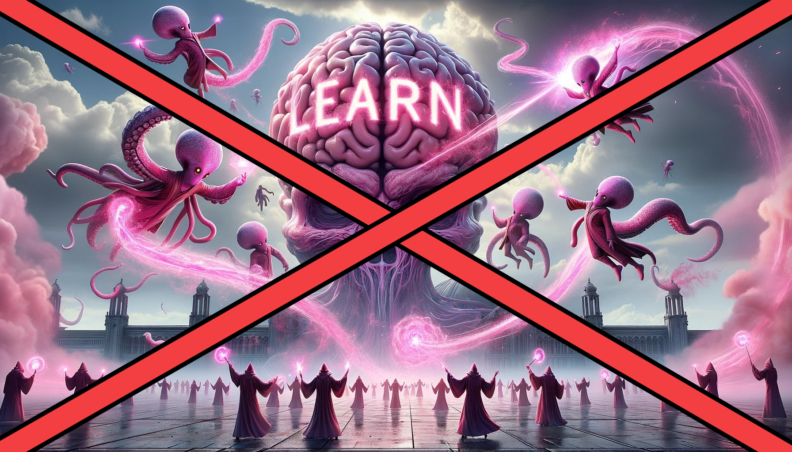

# Unlearn Illithid Powers



Reverts changes from mod [Learn Illithid Powers](original-mod) by [BitterPast](https://next.nexusmods.com/profile/BitterPast/) restoring regular action resourcing.

The above mod has an issue where each action consumes both the regular action and a bonus action (or 2 actions if available). Saving your game with the mod active causes the mod changes to be permanent, even if the mod is disabled afterwards.

This mod fixes the [Learn Illithid Powers](original-mod) mod by removing all Illithid powers from all characters. Keep in mind that this does mean that if you used any tadpoles, you will need to use them again as you will have a clean slate after using this mod.

## Usage:

1. Remove the [Learn Illithid Powers](original-mod) mod from your load order and BG3MM entirely
1. Add this mod
1. Load your save game, and ignore the pop-up saying that [Learn Illithid Powers](original-mod) mod is missing.
1. Create a new save state
1. Quit the game
1. Remove this mod, this can now be safely done
1. Launch the game and load the newly created save from step 4.

Because this mod will reset all your Illithid powers you may want to add new tadpoles to restore your Illithid powers, to do so you can run this command in the Script Extender Console:

```lua
AddTadpole(GetHostCharacter(), X)
```

Replace `X` with the amount of parasites you want.

[original-mod]: https://www.nexusmods.com/baldursgate3/mods/5606
